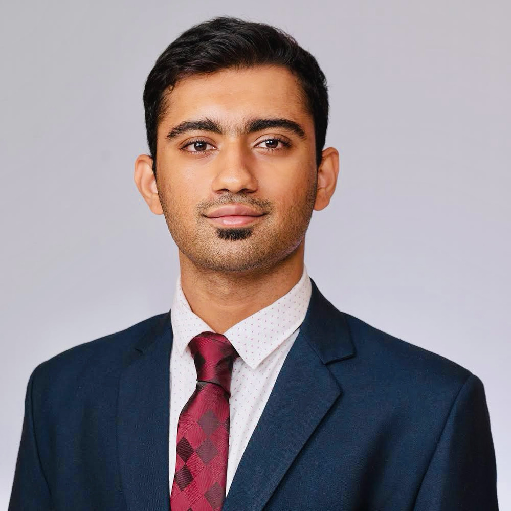

img {
  border-radius: 50%;
}

I am Śaśā́ṅkaḣ (श॒शाङ्कः॑ /ɕɐɕɑ̈́ːŋkɐh/), a recent MS graduate (in Robotics & Autonomous Systems) from Boston University at Boston, USA. Prior to that, I got my BE degree in Electronics & Communication Engineering from BMS College of Engineering in Bangalore, India. I was born in Mangalore and raised in Bangalore, both being cities in the Indian state of Karnataka.

My native language (& the language I happen to be most fluent in) is Konkani. With India being quite a multilingual country, I grew up in a pretty diverse environment enabling me to gain fluency in multiple languages such as Marathi, Hindi and Kannada. Additionally, I acquired working proficiency in languages such as Assamese, Nepali and Portuguese through self-study.

In addition to interests in engineering and robotics, I have a keen interest in Konkani linguistics (concerning both old and new forms of the language) which will be the primary focus of my essays. I am particularly interested in the *diverse varieities of Konkani* as well as the *etymology & semantics* of Konkani words (in addition to general Konkani grammar and the place of Konkani within the larger Indo-Aryan language family).

I hope you like my essays and it helps you learn something new about Konkani.

Cheers!
